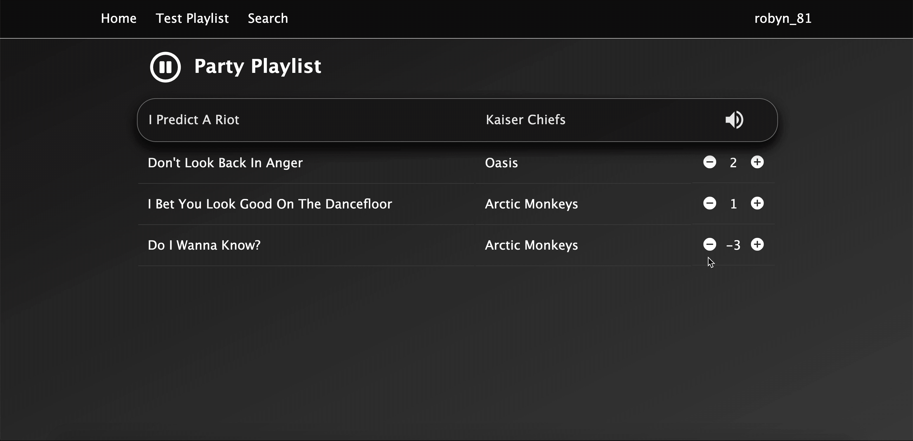
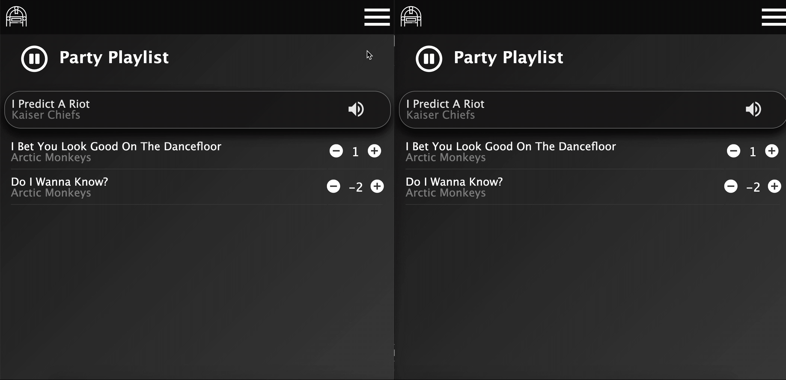

### People's Party Playlist

Add songs to the playlist and re order by voting

Limits the number of upvotes and downvotes by each user

Uses Websockets

Hosted on Heroku - https://peoples-party-playlist.herokuapp.com/

Features:
- Uses the Spotify API
- Keeps the database (MongoDB), Spotify and local state in sync
- All calls try the Spotify API first, if that fails then the database and local state are not updated
- If the Spotify API call succeeds then the database is updated and then the local state 
- Search for songs and add them to the playlist (search input uses debounce)
- Upvote and downvote songs (also uses debounce)
- Number of upvotes and downvotes are limited per person, users are assigned an id via a cookie being dropped when the user visits /invite
- Too many downvotes and the song is removed from the playlist
- Pause and resume playback
- Uses websockets to keep up to date with other user's actions

TODO:
- Move logic for calculating range_start and insert_before from playlist actions to reOrderTrackSpotify
- Change logic for downvoting so that when a track is downvoted and has the same number of votes as other tracks, then the tracks that were most recently updated are above those that were updated earlier
- Set playlist ID via UI
- Complete Storybook stories for all components
- On first render of the playlist page, check if currently playing and display correct play/pause button
- Handle pause playback failure
- Refactor playlist reducer
- Tests
- Change lockedTrack from an array to an obj or null
- Fix requireAuth HOC on playlist (currently preventing SSR)
- Fix playlist id not on process.env